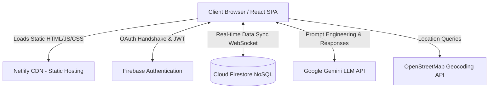

# High-Level Design (HLD): TripCircle

## 1. Architectural Overview
TripCircle utilizes a **Serverless / Backend-as-a-Service (BaaS)** architecture. Instead of deploying a traditional Node.js/Express backend server, the application relies entirely on client-side React code communicating directly with Firebase managed services.

This architecture was chosen to maximize development speed, reduce infrastructure overhead, and natively support real-time WebSocket capabilities without maintaining stateful socket servers.

## 2. Technology Stack
- **Frontend Framework:** React 19 + Vite
- **Styling:** Tailwind CSS 4
- **Routing:** React Router DOM
- **Authentication:** Firebase Auth (Google OAuth Provider)
- **Database:** Cloud Firestore (NoSQL Document DB)
- **AI Integration:** Google Gemini API (`@google/generative-ai`)
- **Mapping:** React Leaflet & OpenStreetMap API
- **Hosting:** Netlify (Global CDN)

## 3. System Architecture Diagram

## 4. Data Flow: Real-Time State Sync
Unlike traditional REST APIs that require polling, TripCircle uses Firestore's `onSnapshot` listeners.

1. **Mount:** React component mounts and establishes a WebSocket connection to a Firestore collection (e.g., `trips`).
2. **Mutation:** Client A creates a new trip using `addDoc()`.
3. **Propagation:** Firestore registers the write and immediately pushes the delta over the WebSocket to Client B.
4. **Re-render:** Client B's `onSnapshot` callback fires, updating the React state (`setTrips`), causing the UI to re-render instantly.

## 5. Security & Authorization Architecture
Since the client talks directly to the database, security cannot be handled by backend middleware. Instead, it is handled at the database edge via **Firestore Security Rules**.

- **Authentication Rule:** `request.auth != null` ensures only logged-in users can write to the database.
- **Resource Ownership:** `request.auth.uid == resource.data.creatorId` ensures users can only modify or delete trips they own.
- **Access Control Lists (ACL):** Chat read/write access is restricted by checking if `request.auth.uid` exists within the document's `participantIds` array.

## 6. AI Subsystem Architecture
The AI integration utilizes the `@google/generative-ai` SDK on the client side.
- **Prompt Engineering:** The client injects dynamic context (Destination, Budget, Days) into a hidden system prompt before sending the user's message to the Gemini model.
- **Structured Output:** The LLM is instructed to return data in specific markdown structures, which the frontend parses and renders as actionable UI components within the chat widget.
