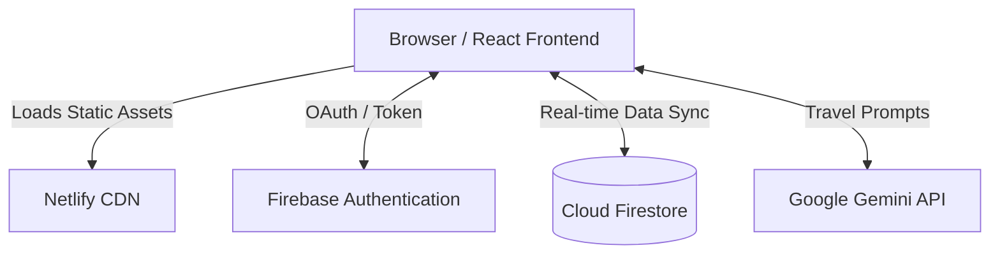
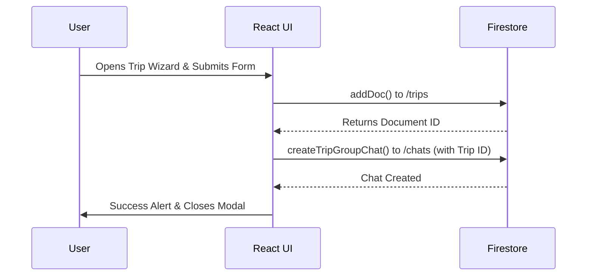
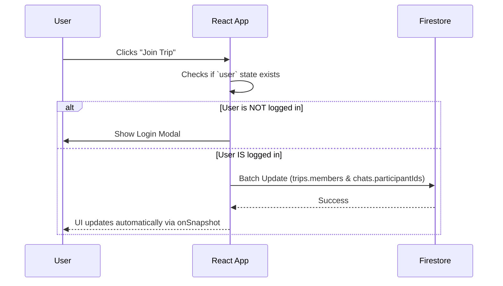

# Project Architecture and Decisions: TripCircle

This document provides a comprehensive technical overview of **TripCircle**. It is designed to help current developers understand the system, onboard future contributors, and serve as a detailed technical reference for engineering interviews.

---

## 1. Project Overview

### What is TripCircle?
TripCircle is a social trip-planning web application.

### What problem does it solve?
Planning group travel is often chaotic, involving scattered messages, spreadsheets, and booking links. TripCircle centralizes this process, allowing users to discover community itineraries, create their own travel plans, and collaboratively join trips with an integrated chat system.

### Who are its target users?
Travelers looking for solo adventures, budget getaways, group tours, or friend outings who want a centralized platform to plan and socialize.

### Core features currently implemented:
- **Google Sign-In:** One-click authentication via Firebase.
- **Trip Discovery:** Browse and filter community trips (Solo, Group, Budget, Adventure).
- **Trip Wizard:** Multi-step form to create new travel itineraries.
- **Real-Time Collaboration:** Join or leave trips, with real-time updates across all connected clients.
- **Integrated Chat (Inbox):** Direct messaging and group chats tied specifically to trips.
- **AI Trip Assistant:** Google Gemini-powered floating chat widget for travel tips.
- **Interactive Map:** Leaflet map integration to preview destinations.
- **User Profiles & My Trips:** Dashboards to manage created and joined trips.

### Future scope and planned enhancements:
- Collaborative trip planning boards (kanban style).
- Group expense splitting (cost tracking).
- Travel feed from followed users.
- Push notifications for trip updates.

---

## 2. System Architecture

### High-Level Architecture Explanation
TripCircle employs a **Serverless/BaaS (Backend-as-a-Service)** architecture. There is no dedicated backend server (e.g., Node.js/Express). Instead, the React frontend communicates directly with Firebase services via the Firebase Client SDKs.

- **Frontend:** React application built with Vite, handling routing, state management, and UI rendering.
- **Authentication:** Firebase Auth handles user identity via Google OAuth.
- **Database:** Cloud Firestore (a NoSQL document database) stores all application data and pushes real-time updates to connected clients via WebSockets.
- **Hosting/Deployment:** Netlify hosts the static frontend build.

### Architecture Diagram



### Data Flow Diagram (Creating a Trip)



---

## 3. Technology Stack

### React
- **Version:** `^19.1.1`
- **Why it was chosen:** Component-based architecture allows for highly reusable UI elements. Strong ecosystem and community support.
- **Alternatives considered:** Vue.js, Svelte.
- **Trade-offs:** Requires a virtual DOM which carries slight memory overhead compared to compiled frameworks like Svelte. Requires additional libraries for routing and state management.
- **Interview Question:** *Why use React over vanilla JavaScript for this project?* 
  - **Answer:** React handles DOM manipulation efficiently through its Virtual DOM and allows state-driven UI, which is critical for complex interfaces like real-time chats and dynamic trip lists.

### Vite
- **Version:** `^7.1.7`
- **Why it was chosen:** Next-generation frontend tooling offering instant server start and lightning-fast Hot Module Replacement (HMR).
- **Alternatives considered:** Create React App (Webpack).
- **Trade-offs:** Ecosystem is slightly less mature than Webpack, though it is rapidly becoming the industry standard.

### React Router
- **Version:** `^7.9.5`
- **Why it was chosen:** Standard routing library for React SPAs, enabling client-side navigation without page reloads.

### Firebase (Auth & Firestore)
- **Version:** `^12.7.0`
- **Why it was chosen:** Rapid development speed. Firestore provides out-of-the-box WebSocket connections for real-time chat and trip updates without needing to manage a WebSocket server or polling logic.
- **Alternatives considered:** Supabase, Custom Node.js + PostgreSQL + Socket.io.
- **Trade-offs:** Vendor lock-in. NoSQL databases lack complex relational querying capabilities, requiring denormalization of data.

### Tailwind CSS
- **Version:** `^4.1.18`
- **Why it was chosen:** Utility-first CSS framework that allows rapid UI development directly within JSX without context switching to CSS files.
- **Alternatives considered:** SCSS, Styled-Components.

---

## 4. Folder Structure

```text
src/
├── components/      # Reusable UI widgets (Header, TripWizard, Categories, etc.)
├── pages/           # Route-level components mapping to specific URLs (Login, Inbox, UserProfile)
├── config/          # Environment and external service configurations (firebase.js)
├── context/         # React Context providers for global state (e.g., AuthProvider) - TO BE FILLED BY DEVELOPER
├── hooks/           # Custom React hooks for abstracting logic - TO BE FILLED BY DEVELOPER
├── services/        # Abstraction layer for external APIs (chatService.js)
├── App.jsx          # Root component, handles global state and routing
└── main.jsx         # Application entry point
```

**Responsibilities:**
- **`components/` vs `pages/`:** Components are dumb/presentational or handle micro-logic. Pages are smart, combining multiple components to fulfill a specific route's purpose.
- **`services/`:** Abstracting Firebase calls into `chatService.js` keeps React components clean and decoupled from the database SDK.

---

## 5. Frontend Architecture

### Routing Strategy
Client-side routing managed by `React Router`. `<Routes>` are defined in `App.jsx`. A custom `<ProtectedRoute>` component wraps sensitive routes (`/inbox`, `/my-trips`, `/settings`) to redirect unauthenticated users.

### State Management Approach
- **Local State:** Component-level state via `useState`.
- **Global State:** Currently, global state (`user`, `trips`) is managed in `App.jsx` and passed down via prop-drilling.
- **Why this approach:** Simple to set up initially.
- **Alternatives:** Redux, Zustand, or React Context API.
- **Trade-offs:** Prop-drilling becomes difficult to maintain as the component tree deepens.

### Data-Fetching Patterns
Data is fetched inside `useEffect` hooks in `App.jsx` using Firestore's `onSnapshot()`. This sets up a persistent WebSocket connection that automatically updates the React state whenever the underlying database changes.

### Error Handling
Primarily handled via `try/catch` blocks in async functions, utilizing simple `alert()` calls or `console.error()` for fallbacks. 
*Future improvement: Implement a global Toast notification system and React Error Boundaries.*

---

## 6. Authentication and Authorization

### Authentication Flow
1. User clicks "Login".
2. `signInWithPopup(auth, googleProvider)` is invoked.
3. Firebase handles the OAuth handshake with Google.
4. On success, a user document is created/updated in the `users` Firestore collection using `setDoc` with `{ merge: true }`.
5. Global `user` state is updated.

### Session Persistence
Managed automatically by Firebase SDK. An `onAuthStateChanged` listener in `App.jsx` runs on app load to verify the stored token and restore the session.

### Sequence Diagram: Join Trip Authorization



---

## 7. Database Design

### Database Technology
**Cloud Firestore** (NoSQL Document Database).

### Collections and Models

#### 1. `users`
- **Fields:** `name`, `email`, `avatar`, `uid`, `lastSeen`
- **Why:** Stores core identity. Used to hydrate user profiles.

#### 2. `trips`
- **Fields:** `name`, `location`, `budget`, `dateRange`, `guests`, `creatorId`, `creatorName`, `members` (Array of UIDs), `tags`, `createdAt`
- **Why:** Represents a travel itinerary. The `members` array is critical for checking who has joined.

#### 3. `chats`
- **Fields:** `type` (group/direct), `tripId`, `participantIds` (Array of UIDs), `participantsData` (Map of denormalized user objects), `lastMessage`, `updatedAt`
- **Why:** Manages chat rooms. `participantsData` denormalizes user avatars and names to prevent N+1 read queries when rendering the Inbox list.

#### 4. `messages` (Subcollection of `chats/{chatId}`)
- **Fields:** `text`, `senderId`, `senderName`, `senderPhotoURL`, `createdAt`
- **Why:** Stores individual messages. Stored as a subcollection to allow infinite scrolling and querying without loading the parent document.

---

## 8. API and Service Documentation

### Firebase Chat Services (`src/services/chatService.js`)

| Function | Purpose | Inputs | Security/Auth Requirements |
|----------|---------|--------|----------------------------|
| `getOrCreateDirectChat` | Initializes a DM room | `currentUser`, `targetUser` | Must be authenticated |
| `createTripGroupChat` | Creates a group chat upon trip creation | `tripId`, `tripName`, `creatorData` | Must be authenticated |
| `sendMessage` | Writes to `messages` subcollection & updates `lastMessage` | `chatId`, `senderData`, `messageText` | User UID must be in `participantIds` |
| `subscribeToUserChats` | Real-time listener for the user's inbox | `userId`, `callback` | User UID must be in `participantIds` |

---

## 9. User Flows

### Creating a Trip
1. User clicks the floating "✈️ Plan Your Trip" button.
2. `TripWizard` modal opens.
3. User fills out Name, Destination, Dates, and Budget.
4. On submit, `addDoc` writes to the `trips` collection.
5. Immediately after, `createTripGroupChat` creates a linked chat room.
6. User receives an alert and modal closes.

---

## 10. Security Review

### Firestore Security Rules
The application enforces security directly at the database level using Firebase Security Rules (`firestore.rules`).

- **Users:** Anyone can read. Users can only write their own document (`request.auth.uid == userId`).
- **Trips:** Anyone can read. Any authenticated user can write (`request.auth != null`). 
  - *Weakness:* Currently, any logged-in user could theoretically modify or delete someone else's trip using API manipulation.
  - *Improvement:* Restrict trip updates to `creatorId` or implement an allowed fields update logic for the `members` array.
- **Chats:** Read/Write heavily restricted. `request.auth.uid` must exist in the `participantIds` array of the chat document.

---

## 11. Performance Considerations

### Current Optimizations
- Real-time WebSockets (`onSnapshot`) eliminate the need for heavy API polling.
- Denormalized `participantsData` in chat documents prevents excessive read operations.

### Bottlenecks and Future Improvements
- **Data Loading Bottleneck:** In `App.jsx`, `collection(db, "trips")` fetches *every single trip* in the database at launch. This will crash or become exorbitantly expensive if the app grows to thousands of trips.
- **Solution:** Implement Firestore cursor pagination (`limit(20)`, `startAfter()`) and Server-Side Filtering.
- **Lazy Loading:** `React.lazy` should be used to split route bundles (e.g., loading Leaflet maps only when needed).

---

## 12. Error Handling Strategy

- **Expected failures:** Network drops, Firebase quota limits, authentication failures.
- **Current Approach:** `try/catch` wrapping asynchronous functions, printing to `console.error`, and displaying basic browser `alert()` popups to the user.
- **Future Improvement:** Replace alerts with a non-blocking Toast UI. Implement centralized error logging (e.g., Sentry) to monitor production crashes.

---

## 13. Testing Strategy

- **Current Status:** Manual testing only. Automated tests are currently omitted to optimize for development speed.
- **Recommended Future Implementation:**
  - **Unit Testing:** Vitest or Jest for helper functions and custom hooks.
  - **Component Testing:** React Testing Library for isolated UI components.
  - **E2E Testing:** Cypress to validate core user flows (Login -> Create Trip -> Send Message).

---

## 14. Deployment Architecture

### Workflow
1. Developer pushes code to the `main` branch on GitHub.
2. **Netlify** detects the commit and triggers a build process (`npm run build`).
3. Vite bundles the application into static HTML/CSS/JS in the `dist/` folder.
4. Netlify deploys the static files to its global CDN.

### Environment Variables
Sensitive keys (Firebase API keys, Gemini API keys) are stored securely in Netlify's Environment Variables dashboard and injected at build time (`VITE_FIREBASE_API_KEY`).

---

## 15. Engineering Decisions and Trade-Offs

### Decision 1: Passing Global State via Props in App.jsx
- **Why:** Quickest way to prototype and get features working.
- **Trade-off:** Component signatures become bloated. To render a sub-component, you must pass props through intermediary components that don't need them.
- **When to change:** As soon as the component tree exceeds 3-4 levels of depth, migrate to Redux Toolkit or React Context.

### Decision 2: Using Firebase Client SDKs directly in React
- **Why:** Immediate real-time sync capabilities and zero server maintenance.
- **Trade-off:** Exposes database logic to the client. Business logic is mixed with UI logic.
- **When to change:** If complex server-side validations, cron jobs, or integration with payment gateways (Stripe) are needed, an intermediary Node.js server will be required.

---

## 16. Scalability Discussion

**What happens when TripCircle grows from 100 users to 1,000,000 users?**

1. **Firestore Read Costs:** The current app fetches all trips at launch. At 1M trips, loading the home page will exhaust Firebase free tiers instantly and crash the client browser. 
   - *Fix:* Implement index-backed queries and pagination.
2. **Chat Scalability:** Group chats with 10,000 members will exceed the 1MB Firestore document size limit because of the `participantsData` map.
   - *Fix:* Move participants to a subcollection or limit group sizes.
3. **State Management:** React's virtual DOM will struggle to diff a single `trips` array holding 10,000 objects.
   - *Fix:* Virtualized lists (e.g., `react-window`) for rendering UI elements.

---

## 17. Accessibility and User Experience

- **Responsive Design:** Utilizes Tailwind CSS grid and flexbox utilities to adapt from mobile screens to 4K displays.
- **Improvements Needed:** 
  - Add `aria-labels` to icon-only buttons (like the close button on the Trip Wizard).
  - Ensure color contrast ratios meet WCAG guidelines.
  - Add keyboard navigation support (`tabIndex`, `onKeyDown` handlers).

---

## 18. Troubleshooting Guide

| Symptom | Cause | Resolution |
|---------|-------|------------|
| **Blank screen on load / Vite error** | Missing Environment Variables | Ensure `.env` is created locally with all `VITE_FIREBASE_*` keys. |
| **"Insufficient Permissions" in Console** | Firestore Rules | Check `firestore.rules`. User must be authenticated to write to `/trips` or `/chats`. |
| **New trip does not appear** | Network/Cache issue | Force refresh. Verify Firestore quota limits haven't been exceeded in the Firebase Console. |

---

## 19. Frequently Asked User Questions (FAQs)

- **Do I have to pay to use TripCircle?** 
  No, TripCircle is completely free for planning and socializing.
- **Are my chats private?**
  Direct messages are strictly between you and the recipient. Trip group chats are visible to anyone who joins the trip.
- **How do I delete a trip I created?**
  Navigate to "My Trips" from the profile dropdown, locate the trip, and click the delete icon.

---

## 20. Frequently Asked Interview Questions

### Beginner Level
**Q: What is the difference between `useEffect` and `useState` in your application?**
> **Answer:** `useState` is used to hold data that changes over time and triggers a UI re-render when updated (e.g., form input in the Trip Wizard). `useEffect` is used to handle side effects, such as subscribing to Firestore data streams or Firebase Authentication state changes when the component mounts.

### Intermediate Level
**Q: Explain how you manage real-time updates in the TripCircle chat system.**
> **Answer:** I use Firestore's `onSnapshot` method. Instead of fetching messages once, `onSnapshot` opens a WebSocket connection to the database. Whenever a new document is added to the `messages` subcollection, Firebase pushes the delta to the client, triggering a React state update and instantly rendering the new message without the user needing to refresh.

**Q: I noticed your Firebase API keys are prefixed with `VITE_` and pushed to the browser. Is this a security risk?**
> **Answer:** No. In a Firebase BaaS architecture, the API keys only identify the project to Firebase servers; they do not grant administrative privileges. True security is enforced via Firebase Security Rules (`firestore.rules`), which dictate what an authenticated user can and cannot read/write. I also restrict the API keys in the Google Cloud Console to only accept requests from my Netlify domain.

### Advanced Level
**Q: Your current application fetches all trips using `collection(db, "trips")`. How would you re-architect this to handle 100,000 trips efficiently?**
> **Answer:** The current approach pulls the entire collection into memory, which is inefficient and costly. I would implement three changes: 
> 1. **Pagination:** Use Firestore's `query`, `orderBy`, `limit(10)`, and `startAfter(lastDocument)` to fetch data in chunks as the user scrolls.
> 2. **Server-Side Filtering:** Instead of filtering locally via JavaScript (e.g., `trips.filter()`), I would apply `.where("tags", "array-contains", "Solo")` directly to the Firestore query to reduce payload size.
> 3. **Indexes:** Create composite indexes in the Firebase Console to support complex, multi-field queries quickly.

---

## 21. Lessons Learned

- **Database Denormalization:** Coming from a SQL background, it was initially difficult to duplicate user data (avatars/names) into the chat documents. However, I learned this is a necessary NoSQL pattern to avoid expensive "join-like" N+1 queries.
- **State Sprawl:** Managing complex state in `App.jsx` proved unwieldy. In hindsight, implementing a global context provider specifically for the `Trips` data would have cleaned up the component hierarchy significantly.

---

## 22. Future Roadmap

- **Phase 1: Performance Refactor**
  - Implement infinite scrolling and query pagination for the main feed.
  - Implement React Context API to remove prop-drilling.
- **Phase 2: Core Feature Enhancements**
  - Group expense splitting tools integrated into the Trip Details page.
  - Collaborative drag-and-drop itinerary building.
- **Phase 3: Observability**
  - Integrate Sentry for error tracking.
  - Add Google Analytics to track user conversion flows (e.g., Wizard abandonment rate).

---
*Generated by Developer / AI Assistant for Technical Review.*
