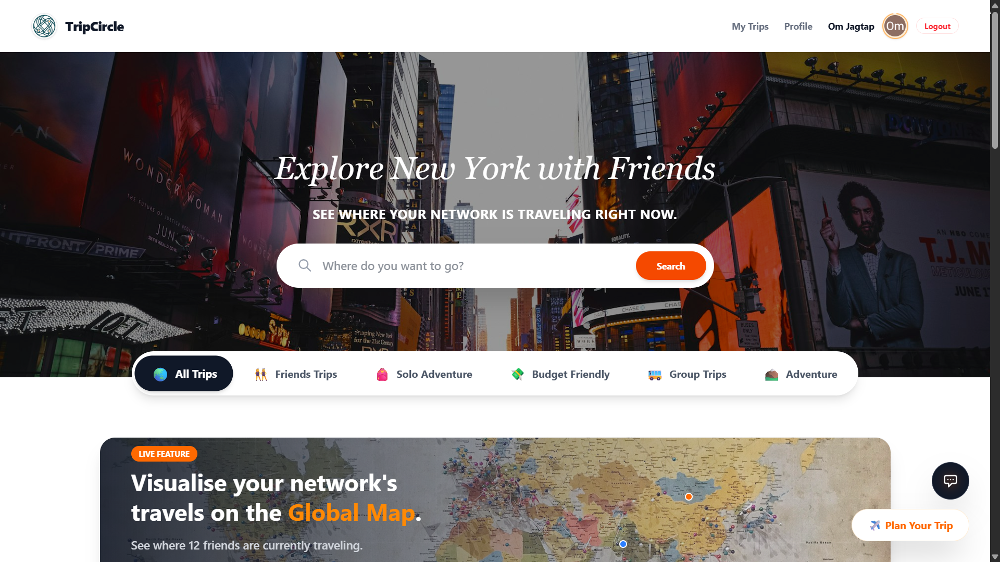
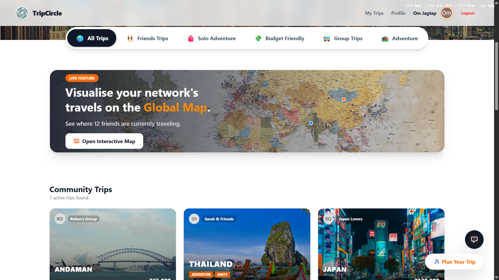
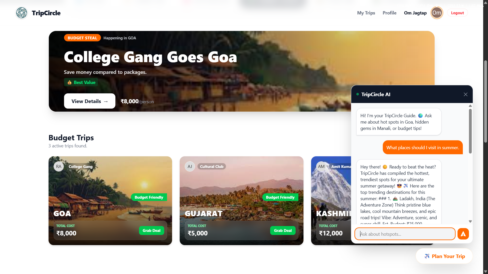

# ✈️ TripCircle

**TripCircle** is a social trip-planning web app where users can discover, create, and join travel itineraries together. Find trips by category — solo adventures, budget getaways, group tours, or friend outings — and connect with a community of travellers.

🌐 **Live Demo → [tripcircle.netlify.app](https://tripcircle.netlify.app/)**

---

## 🚀 Features

- **Google Sign-In** — one-click authentication via Firebase Auth
- **Browse Trips** — discover community trips filtered by category (Solo, Group, Budget, Adventure, Friends)
- **Plan a Trip** — multi-step Trip Wizard to create and publish your itinerary to the shared feed
- **Join / Leave Trips** — real-time member updates stored in Firestore
- **My Trips** — personal dashboard showing trips you've created
- **Destination Search** — search any destination and see matching trips
- **Trip Assistant** — AI-powered floating chat widget (Google Gemini) for travel tips
- **Interactive Map** — powered by Leaflet for a visual map teaser
- **Category Spotlight** — curated highlight card for the active category
- **Trending Destinations** — editor-curated popular places

---

## 📸 Screenshots

### Home & Trip Discovery


### Trip Wizard


### AI Trip Assistant


---

## 🛠️ Tech Stack

| Layer       | Technology                          |
|-------------|-------------------------------------|
| Frontend    | React 19, Vite                      |
| Styling     | Tailwind CSS v4                     |
| Auth        | Firebase Authentication (Google)    |
| Database    | Cloud Firestore (real-time)         |
| AI          | Google Generative AI (Gemini)       |
| Maps        | Leaflet + React Leaflet             |
| Hosting     | Netlify                             |

---

## 📁 Project Structure

```
src/
├── components/              # Reusable UI components
│   ├── Header.jsx
│   ├── Hero.jsx
│   ├── Categories.jsx
│   ├── TripWizard.jsx       # Multi-step trip creation
│   ├── TripAssistant.jsx    # Gemini AI chat widget
│   ├── MapView.jsx          # Leaflet map integration
│   └── ...
├── pages/                   # Route-level components
│   ├── Login.jsx
│   ├── UserProfile.jsx
│   └── DestinationDetails.jsx
├── config/
│   └── firebase.js          # Firebase config & exports
├── context/                 # Global auth state
├── hooks/                   # Custom React hooks
└── App.jsx
```

---

## ⚙️ Getting Started

### Prerequisites
- Node.js ≥ 18
- A Firebase project with Firestore & Google Auth enabled

### Installation

```bash
git clone https://github.com/OmJagtap07/TripCircle.git
cd TripCircle
npm install
```

### Environment Variables

Create a `.env` file in the project root:

```env
VITE_FIREBASE_API_KEY=your_api_key
VITE_FIREBASE_AUTH_DOMAIN=your_project.firebaseapp.com
VITE_FIREBASE_PROJECT_ID=your_project_id
VITE_FIREBASE_STORAGE_BUCKET=your_project.appspot.com
VITE_FIREBASE_MESSAGING_SENDER_ID=your_sender_id
VITE_FIREBASE_APP_ID=your_app_id
VITE_GEMINI_API_KEY=your_gemini_key
```

### Run Locally

```bash
npm run dev
```

Open [http://localhost:5173](http://localhost:5173).

---

## 🚢 Deployment

This app is deployed on **Netlify** via continuous deployment from GitHub.

```bash
npm run build   # Outputs to dist/
```

Push to `main` → Netlify auto-deploys.

---

## 🗺️ Roadmap

- [x] Google authentication
- [x] Trip creation with multi-step wizard
- [x] Real-time join/leave with Firestore
- [x] AI travel assistant (Gemini)
- [x] Interactive map (Leaflet)
- [x] User profiles with trip history
- [ ] Collaborative trip planning boards
- [ ] Group expense splitting
- [ ] Travel feed from followed users
- [ ] Push notifications for trip updates

---

## 📄 License

MIT © [Om Jagtap](https://github.com/OmJagtap07)
